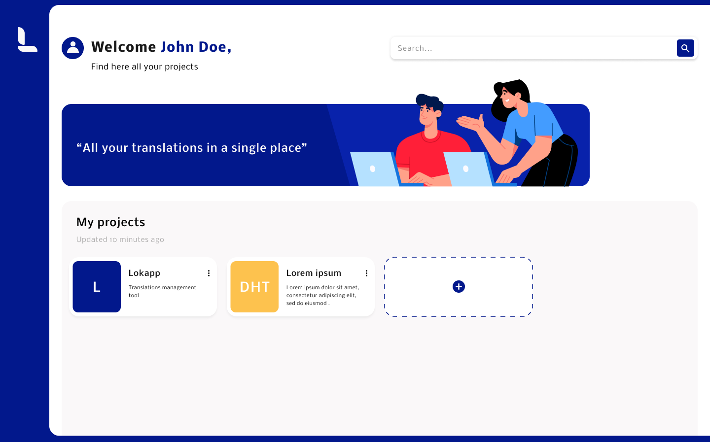

# Lokapp

<p align="center">
   <a href="https://www.lokapp.io/">
     
   </a>
</p>

[](https://lokapp.io)

Webapp using our [API](https://github.com/lokappio/lokapp-api) to help you manage all your project's translations.

## Table of contents

* [About the project](#about-the-project)
* [Getting started](#getting-started)
* [Usage](#usage)




## About the project

This webapp provides you a friendly interface for our <a href="https://github.com/lokappio/lokapp-api">Lokapp API</a> to easily manage the translations of your projects.

### Built with

Here are some tools this project has been built with:

* [Vue.js](https://vuejs.org/)  
* [Vuetify](https://vuetifyjs.com/)  
* [Firebase Authentication](https://firebase.google.com/products/auth)

### Features

#### Export translation files

Export your translations into specific files for Android, iOS or Web (JSON) projects.

#### Projects

Create as many projects as you want, each one with its own languages, translations and users. 
You can import a project from existing files you own.

#### Roles and invitations

Manage your users and who can access to your projects.

See the [Role](documentation/roles.md) documentation to learn more about the different roles that can be handled.

#### Groups

Create groups within a project in order to get a tidy list of translations and be able to export nested transaltions in JSON.

#### Translations

Specify which languages your project supports, then manage your translation keys and their translated content.

Create groups to organize your translations by module or by feature for instance.

#### Plurals

Handle both singular and plural translations. 

See the [Plural](documentation/plurals.md) documentation to learn more about how to deal with plurals strings.


## Getting Started

### Pre-requisites

If you use pnpm, you have to install `node-gyp` globally before installing the dependencies.

```bash
pnpm i --global node-gyp
```

### Installation

Install dependencies
```bash
  npm install
```

Start locally
```bash
  npm run serve:dev
```

Build for production
```bash
  npm run build
```

### Environment Variables

To run the web application, you need to add the following environment variables to your .env file (You can copy the .env.example file and change its content):

```
cp .env.example .env
```

* `VUE_APP_I18N_FALLBACK_LOCALE`: the default language of Lokapp. If the browser language isn't supported yet by Lokapp, this language will be used. Default: english.
* `VUE_APP_BASE_URL`: the base URL of the Lokapp's API.
* `VUE_APP_FIREBASE_API_KEY`: your firebase api key
* `VUE_APP_FIREBASE_AUTH_DOMAIN`: your firebase auth domain
* `VUE_APP_FIREBASE_PROJECT_ID`: your firebase project id
* `VUE_APP_FIREBASE_STORAGE_BUCKET`: your firebase storage bucket
* `VUE_APP_FIREBASE_MESSAGINGSENDER_ID`: your firebase messaging sender id
* `VUE_APP_FIREBASE_APP_ID`: your firebase app id
* `VUE_APP_FIREBASE_MEASUREMENT_ID`: your firebase measurement id


## Usage

### Locally

Once the site is up and running, go to [http://localhost:8080/](http://localhost:8080/)


### Demo

To try out our product, you can use our [demo](https://demo.lokapp.io).


## License

Distributed under the Apache 2.0 License. See `LICENSE` for more information.


## Acknowledgements

<a href="https://playmoweb.com/">
  
</a>

*Lokapp* is built by [Playmoweb](https://playmoweb.com), a mobile agency building web apps and native Android and iOS applications.
