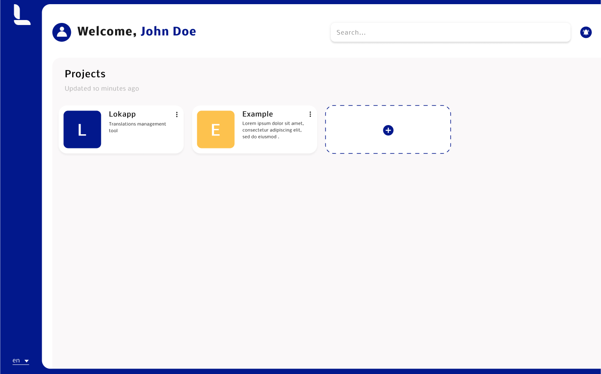

<!-- Project's logo -->
<p align="center">
  <a href="https://www.lokapp.io/">
    
  </a>

  <h2 align="center">Lokapp</h2>

  <p align="center">
    Webapp using our <a href="https://github.com/lokappio/lokapp-api">API</a> to help you manage all your project's translations.
    <br />
    <br />
  </p>
</p>

<!-- Table of Contents -->
<details open="open">
  <summary>Table of Contents</summary>
  <ol>
    <li>
      <a href="#about-the-project">About the project</a>
      <ul>
        <li><a href="#built-with">Built with</a></li>
        <li><a href="#features">Features</a></li>
      </ul>
    </li>
    <li>
      <a href="#getting-started">Getting Started</a>
      <ul>
        <li><a href="#installation">Installation</a></li>
        <li><a href="#environment-variables">Environment variables</a></li>
      </ul>
    </li>
    <li>
      <a href="#usage">Usage</a>
      <ul>
        <li><a href="#locally">Locally</a></li>
        <li><a href="#snake_case">snake_case</a></li>
        <li><a href="#demo">Demo</a></li>
      </ul>
    </li>
    <li><a href="#license">License</a></li>
    <li><a href="#acknowledgements">Acknowledgements</a></li>
  </ol>
</details>




## About the project

This webapp provides you a friendly interface for our <a href="https://github.com/lokappio/lokapp-api">Lokapp API</a> to easily manage the translations of your projects.


### Built with

Here are some tools this project has been built with:

* [Vue.js](https://vuejs.org/)  
* [Vuetify](https://vuetifyjs.com/)  
* [Firebase Authentication](https://firebase.google.com/products/auth)


### Features

#### Export translation files

Export your translations into specific files for Android, iOS or Web (JSON) projects.

#### Projects

Create as many projects as you want, each one with its own languages, translations and users. 

#### Roles and invitations

Manage your users and who can access to your projects.

See the [Role](documentation/roles.md) documentation to learn more about the different roles that can be handled.

#### Groups

Create groups within a project in order to get a tidy list of translations and be able to export nested transaltions in JSON.

#### Translations

Specify which languages your project supports, then manage your translation keys and their translated content.

Create groups to organize your translations by module or by feature for instance.

#### Plurals

Handle both singular and plural translations. 

See the [Plural](documentation/plurals.md) documentation to learn more about how to deal with plurals strings.


## Getting Started

### Installation

Install dependencies
```bash
  yarn install
```

Start locally
```bash
  yarn run serve
```

Build for production
```bash
  yarn run build
```

### Environment Variables

To run the web applicaiton, you need to add the following environment variables to your .env file (You can copy the .env.sample file and change the content):

* `VUE_APP_I18N_FALLBACK_LOCALE`: the default language of Lokapp. If the browser language isn't supported yet by Lokapp, this language will be used. Default: english.
* `VUE_APP_BASE_URL`: the base URL of the Lokapp's API.
* `VUE_APP_FIREBASE_API_KEY`: your firebase api key
* `VUE_APP_FIREBASE_AUTH_DOMAIN`: your firebase auth domain
* `VUE_APP_FIREBASE_PROJECT_ID`: your firebase project id
* `VUE_APP_FIREBASE_STORAGE_BUCKET`: your firebase storage bucket
* `VUE_APP_FIREBASE_MESSAGINGSENDER_ID`: your firebase messaging sender id
* `VUE_APP_FIREBASE_APP_ID`: your firebase app id


## Usage

### Locally

Once the site is up and running, go to [http://localhost:8080/](http://localhost:8080/)

### snake_case

By default, all translation keys needs to be written in snake_case.

### Demo

To try out our product, you can use our [demo](https://demo.lokapp.io).


## License

Distributed under the Apache 2.0 License. See `LICENSE` for more information.


## Acknowledgements

<a href="https://playmoweb.com/">
  
</a>

*Lokapp* is built by [Playmoweb](https://playmoweb.com), a mobile agency building web apps and native Android and iOS applications.
